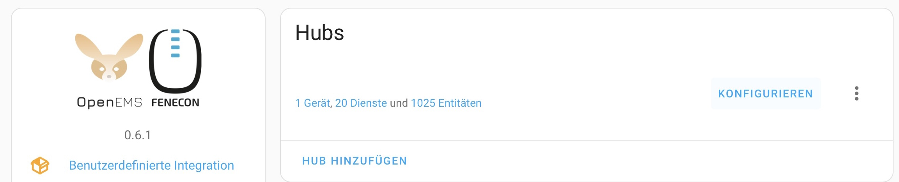
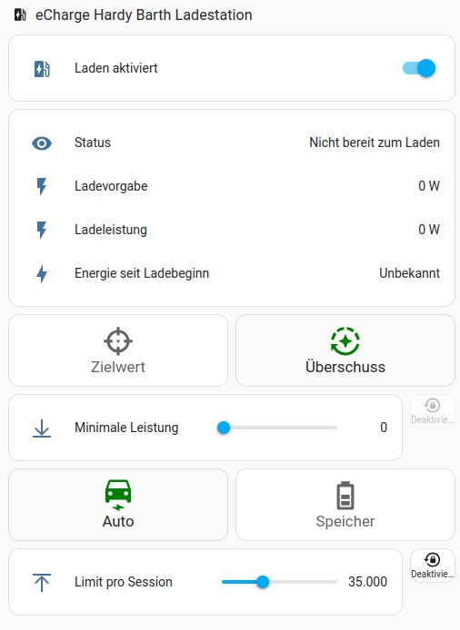
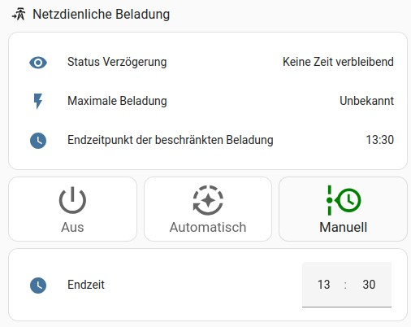
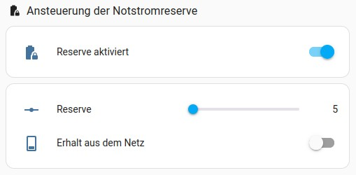
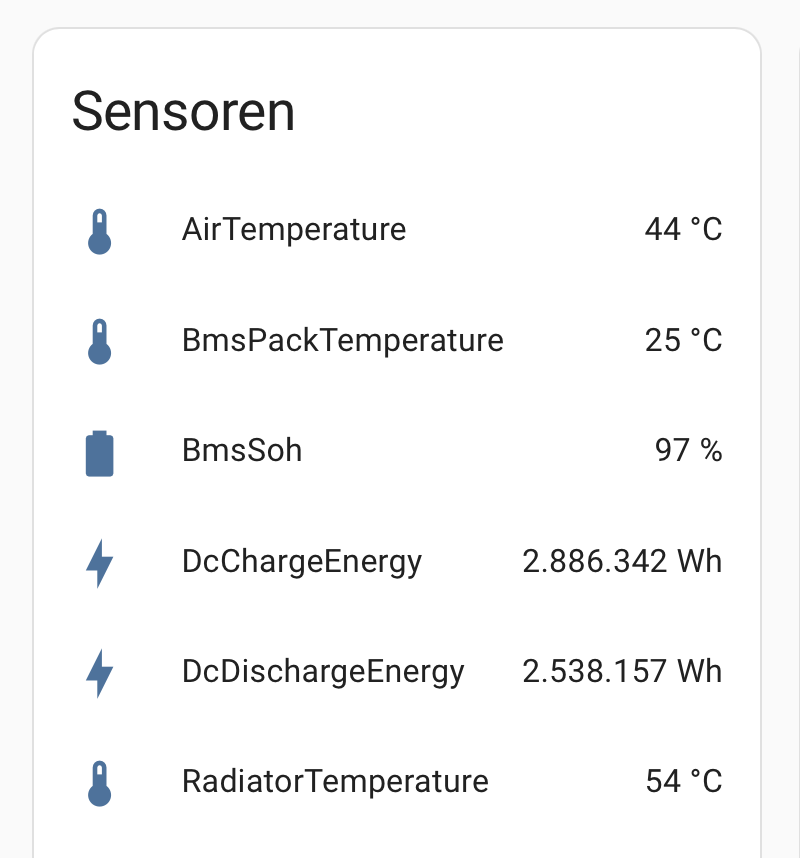
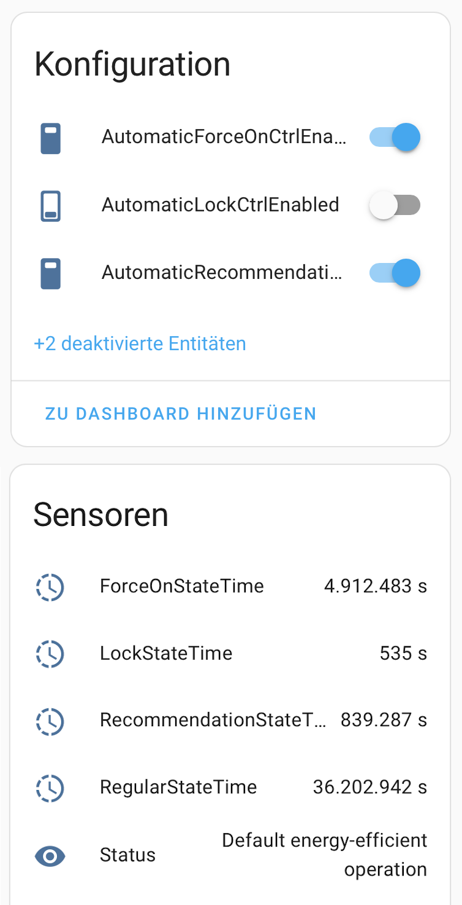
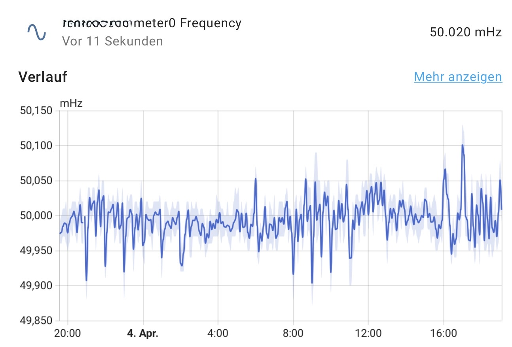

# ha_openems
Home Assistant integration that interfaces FEMS and OpenEMS.

## Overview

* The integration provides full read and write access to Fenecon and OpenEMS systems. Every property which is accessible or configurable via the regular UI is made available equally in the Home Assistant UI.
* Integration of every backend property, even if not accessible via the regular UI.
* Backend system configuration is made fully visible and accessible to the Home Assistant UI:
	*	[Components](https://openems.github.io/openems.io/openems/latest/coreconcepts.html#_openems_component) are made available as Home Assistant service devices. 
	*	[Channels](https://openems.github.io/openems.io/openems/latest/coreconcepts.html#_channel) are made available as entities.\
   		
*	Pre-configured UI cards for Storage, Charging Station and Optimized Charges apps. These cards are equal in the offered functionality as the regular Fenecon/OpenEMS built-in UI components. 

## Features / Common Use-cases:

### Energy Dashboard
Use the following entities to configure the Energy Dashboard:
<table>
  <tr><th>Area</th><th>Option</th><th>Component</th><th>Channel</th><th><i>comment</i></th></tr>
  <tr><td rowspan="2">Electricity Grid</td><td>Grid Consumption </td><td>_sum</td><td>GridBuyActiveEnergy</td><td></td></tr>
  <tr><td>Return to Grid </td><td>_sum</td><td>GridBuyActiveEnergy</td><td></td></tr>
  <tr><td rowspan="3">Solar Panels</td><td rowspan="3">Solar production </td><td>_sum</td><td>ProductionActiveEnergy</td><td><i>combined view</i></td></tr>
  <tr><td>pvInverter*</td><td>ActiveProductionEnergy</td><td rowspan="2"><i>individual view</i></td></tr>
  <tr><td>charger*</td><td>ActualEnergy</td></tr>
  <tr><td rowspan="4">Home Battery Storage</td><td rowspan="4">Battery systems</td><td>_sum</td><td>EssDcDischargeEnergy</td><td rowspan="2"><i>combined view</i></td></tr>
  <tr><td>_sum</td><td>EssDcChargeEnergy</td></tr>
  <tr><td>ess*</td><td>DcChargeEnergy</td><td rowspan="2"><i>individual view</i></td></tr>
  <tr><td>ess*</td><td>DcDischargeEnergy</td></tr>
</table>

### [Power Flow card plus](https://github.com/flixlix/power-flow-card-plus)
Use the following entities to configure the Power Flow card plus:
<table>
  <tr><th>Area</th><th>Option</th><th>Component</th><th>Channel</th></tr>
  <tr><td>Grid</td><td>Combined</td><td>_sum</td><td>GridActivePower</td></tr>
  <tr><td>Solar</td><td></td><td>_sum</td><td>ProductionActivePower</td></tr>
  <tr><td rowspan="2">Battery</td><td>Combined</td><td>_sum</td><td>EssDischargePower</td></tr>
  <tr><td>State of Charge</td><td>_sum</td><td>EssSoc</td></tr>
  <tr><td>Home</td><td></td><td>_sum</td><td>ConsumptionActivePower</td></tr>
</table>

### Apps (template UI cards)

To use the template cards, do the following:
1. The template cards depend on the following prerequisites (Please install via HACS):
     * [Decluttering card](https://github.com/custom-cards/decluttering-card)
     * [Config template card](https://github.com/iantrich/config-template-card)
     * [Button card](https://github.com/custom-cards/button-card)
     * [Template entity row](https://github.com/thomasloven/lovelace-template-entity-row)
3. Navigate to the dashboard in which you want to use the card
4. Select edit mode (pencil on the top right corner)
5. From the 3-dots menu in the top right corner, select "raw editor"
6. Paste the full contents of [openems_templates.yaml](openems_templates.yaml) before the dashboard contents
7. Go back to regular edit mode
8. add a new user-defined card, using yaml. 

*All texts are automatically translated to your Home Assistant default language*

#### EV Charging
**Sample Card config**
```
type: custom:decluttering-card
template: evcs_template
variables:
  - system: fems12345
  - evcs_id: 0
  - ctrlevcs_id: 0
```

**Card variables**
* `system`: Set to your FEMS/OpenEMS system name
* `evcs_id`: Set to your EVCS AppID. Eg `0` if your EVCS component is called `evcs0`. Default value: 0
* `ctrlevcs_id`: Set to your CtrlEVCS AppID. Eg `1` if your EVCS component is called `ctrlEvcs1`. Default value: 0

**Card screenshot** (German version)\


#### Grid Optimized Charge
**Sample Card config**
```
type: custom:decluttering-card
template: optchrg_template
variables:
  - system: fems12345
  - ctrlgridoptimizedcharge_id: 0
```

**Card variables**
* `system`: Set to your FEMS/OpenEMS system name
* `ctrlgridoptimizedcharge_id`: Set to your grid optimized charge AppID. Eg `5` if your optchrg component is called `ctrlGridOptimizedCharge5`. Default value: 0

**Card screenshot** (German version)\
_Note: unapplicable options are automatically hidden and thus not visible in the screenshot_


#### Emergency Capacity Reserve
**Sample Card config**
```
type: custom:decluttering-card
template: ess_template
variables:
  - system: fems12345
  - ctrlemergencycapacityreserve_id: 0
```

**Card variables**
* `system`: Set to your FEMS/OpenEMS system name
* `ctrlemergencycapacityreserve_id`: Set to your emergency capacity AppID. Eg `0` if the component is called `ctrlEmergencyCapacityReserve0`. Default value: 0

**Card screenshot** (German version)\


### Additional commonly used components

#### BatteryInverter*
Contains entities for inverter properties like:
- temperatures of inverter, air, ...
  - `bmspacktemperature`
  - `airtemperature`
  - `radiatortemperature`
- The state of health: `bmssoh`


#### CtrlIoHeatPump*
Here you will find the current state of your SG ready connected heatpump.\


#### meter*
Here you find the grids frequency.\


## Installation

### HACS

1. Install HACS (https://hacs.xyz/docs/setup/download)
2. Manually add [this repository](https://github.com/Lamarqe/ha_openems) to HACS
3. Select and enable "FEMS & OpenEMS" Integration

## Configuration
### Basic configuration
1. Enter your connection details: 
   - IP address or hostname
   - User name (typically "x" for FEMS systems)
   - Password:
     - `user` for read-only access
     - `owner` for control access

If you only want to use the default options, you are all set. 
### Advanced configuration
2. Select "configure" on the config entry and select the devices for which you want entities to be created (skip this part if you only want to use the default options)
3. Enable additional entities 

## Disclaimer

### Tested Setups

* Fenecon Home 10 systems with 
	* EV Chargers
		* Keba 
		* Hardy Barth
	* FEMS Relaisboard
	* Heatpumps (Fenecon App Power to Heat)
		*  Vaillant

### Limitations

 - Due to missing test environments, multi-edge systems are expected to cause problems. Issues will be resolved in cooperation with first users. Please give it a try and report bugs here.
- This integration is not affiliated with Fenecon.
	- Fenecon might change APIs with upcoming version.
	- The developers take no responsibility for anything that happens to your equipment due to this integration. I.e., 
		- Please be careful with controlling entities which are not enabled by default.
		-  By default, only a few pre-configured channels are enabled per component. However, there is no limitation how many channels can be enabled in parallel. Please be careful about expanding to very large numbers (multiple hundreds).
